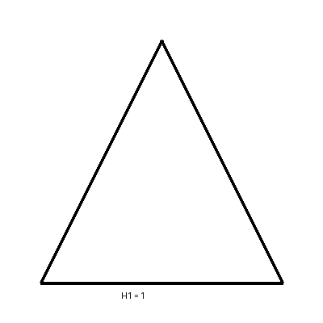
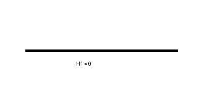
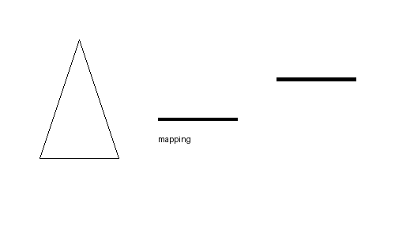
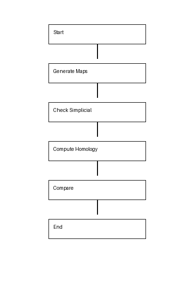

# 🧠 Simplicial Mapping Analyzer – Topological Data Analysis (TDA)

A Python-based project that explores simplicial maps between small complexes and analyzes whether these mappings preserve topological structures using homology.

This project demonstrates how to enumerate all possible simplicial maps and detect whether features like connected components and loops are preserved.

---

## 🚀 Features

- 📊 Generate simplicial complexes (triangle, line)
- 🔄 Exhaustive enumeration of vertex mappings
- ✅ Validate simplicial maps
- 📈 Classify maps:
  - Injective
  - Surjective

---

## 🧠 Detect

- Connected components (H₀)
- Loops / holes (H₁)

⚡ Simple and educational implementation  
🎯 Ideal for algebraic topology learning  

---

## 🧰 Technologies Used

## 🔹 Programming
Python 3  

## 🔹 Libraries
- itertools (built-in)

---

## 📁 Project Structure

tda-simplicial-mapping/
│
├── main.py
├── README.md
├── images/
│   ├── triangle.png
│   ├── line.png
│   ├── mapping.png
│   └── flowchart.png


---


## ⚙️ Installation

```bash
git clone https://github.com/tfregixx/Simplicial-Mapping-Analyzer.git
cd Simplicial-Mapping-Analyzer


▶️ Usage

python main.py
``

🔄 How It Works

- **Generate vertex mappings**
- **Check simplicial condition**
- **Classify maps**
- **Compute homology (H₀, H₁)**
- **Compare structures**


---

## 🖼️ Diagrams

### Triangle Complex (K)


### Line Complex (L)


### Mapping Visualization


---

## 📊 Flowchart



## 📉 Example Output

- **Homology of K: (1, 1)**
- **Homology of L: (1, 0)**

❌ Homology NOT preserved

---

## 📈 Key Insights

- **✅ Simplicial maps preserve local structure**
- **✅ Homology captures global topology**
- **✅ Loops may disappear under mapping**
- **✅ Not all mappings preserve topology**

## 🔮 Future Work

- **Larger complexes**
- **Matrix-based homology**
- **Persistent homology**
- **Visualization tools**

---

## 📌 Author

Preethi Regina Sundaram Dayalan
Student – Topological Data Analysis Project

---

